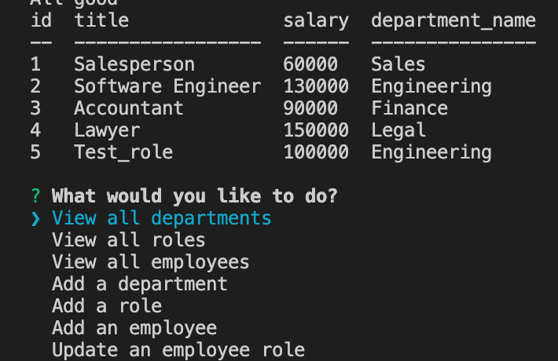

# Title: Employee Tracker Challenge 

## Table of Contents

* [Description](#description)

* [Installation](#installation)

* [Usage](#usage)

* [Contributing](#contributing)

* [Tests](#tests)

* [License](#license)

* [Media](#media)

* [Questions](#questions)

## Description

This is a command-line application that allows the user to manage departments, roles, and employees in a company. When the application is started, the options 'view all departments', 'view all roles', 'view all employees', 'add a department', 'add a role', 'add an employee', and update an employee role are shown. WHen the user chooses one of the view options, the corresponding subject matter is displayed to the user. When a user chooses to add a department, role, or employee, then when they view the corresponding subject, they can see the subject has been added. When the user chooses to update an employee's role, the user can update the role as well.

## Installation

Make sure the node package manager is installed with command 'npm install' after you have selected the index.js file, and then run 'node index.js' to start the program and go to the home page of the program.

## Usage

Use this app for viewing and managing department, role and employee information.

## Contributing

Jack Warrick

## Tests

None

## License

This application is covered under the MIT License.

## Media

**Screenshot of application working:**

**Demonstration Video:**

[Link to Demonstration Video](https://drive.google.com/file/d/1y8d7HJtb2jHHE9Bw1FGkSFjUzb1k7PvM/view)

## Questions

For more information, please reference my GitHub profile [here](https://github.com/JackWarrick), or reach out to my email: j.d.warrick@comcast.net.

